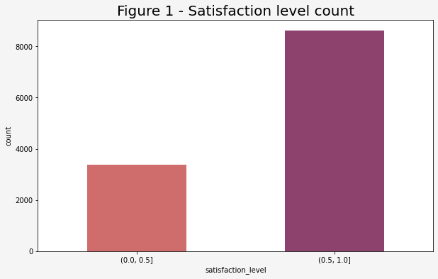

# **Google Advanced Data Analytics Capstone Project**

## **Salifort Motors HR Department**

This is my capstone project for the Google Advanced Data Analytics course from Google and Coursera. The project includes an analysis  of a dataset and the construction of predictive models that can provide insights to the Human Resources (HR) department of a large industrial firm.
---

### **Business scenario and problem**

The HR department at Salifort Motors wants to take some initiatives to improve employee satisfaction levels at the company. They collected data from employees, and now they need to extract useful insights from it. They want data-driven in order to answer the following question: what’s likely to make the employee leave the company?

The goals set to accomplish this project are:
 - Analyze the data collected by the HR department
 - Build a model that predicts whether or not an employee will leave the company.

The logic behind the project is that if the resignation of employees can be predicted, it might be possible to identify factors that contribute to they leaving. Because it is time-consuming and expensive to find, interview, and hire new employees, increasing employee retention will be beneficial to the company.

### **The data used in the project**

The dataset contains data about employees with 15,000 rows and 10 columns. In the following table, a summary of the variables with the corresponding description

Variable  |Description |dtype |
-----|-----|-----|
satisfaction_level|Employee-reported job satisfaction level [0&ndash;1]|float64|
last_evaluation|Score of employee's last performance review [0&ndash;1]|float64|
number_project|Number of projects employee contributes to|int64|
average_monthly_hours|Average number of hours employee worked per month|int64|
time_spend_company|How long the employee has been with the company (years)|int64|
Work_accident|Whether or not the employee experienced an accident while at work|int64|
left|Whether or not the employee left the company|int64|
promotion_last_5years|Whether or not the employee was promoted in the last 5 years|int64|
Department|The employee's department|object|
salary|The employee's salary (U.S. dollars)|object|

An Exploratory Data Analysis is conducted to find, correct an structure the possible deficiencies in the dataset configuration (ex. null or duplicated values).

Initiating the analysis from the level of satisfaction expressed by the workers, and setting and arbitrary division at 0.5 points (in a scale from 0 to 1) to separate satisfied from unsatisfied employees, a first view shows that a 71.78% (8607 cases) expresses a satisfaction > than 0.5, and 28.22% (3384 cases) a satisfaction below that level, as the following visualization shows:

From this point, the analysis ivestigates the possible variables that may influence the level of satisfaction of the staff. This task is achieved using the tools provided by the packages explored during the course

### **Tools**

The task have been done in a Jupyter Notebook, using the following pacjages for the Python language:
- **Numpy** and **Pandas** for data analysis and manipulation
- **Matplotlib** and **Seaborn** for data visualizations
- **Scikit-learn** is used to machine learning model construction

### **Model**

A Logistic Regression model is constructed, due to the binary characterization of the target variable (`left` column). The objective of the model is to predict the departure of employees based on the relevant features contained in the dataset.

### **Deliverables**

The process produced two deliverables:
1. A Jupyter Notebook with all the work done
2. A executive summary with the most important results to comunicate to the stakeholders in the project